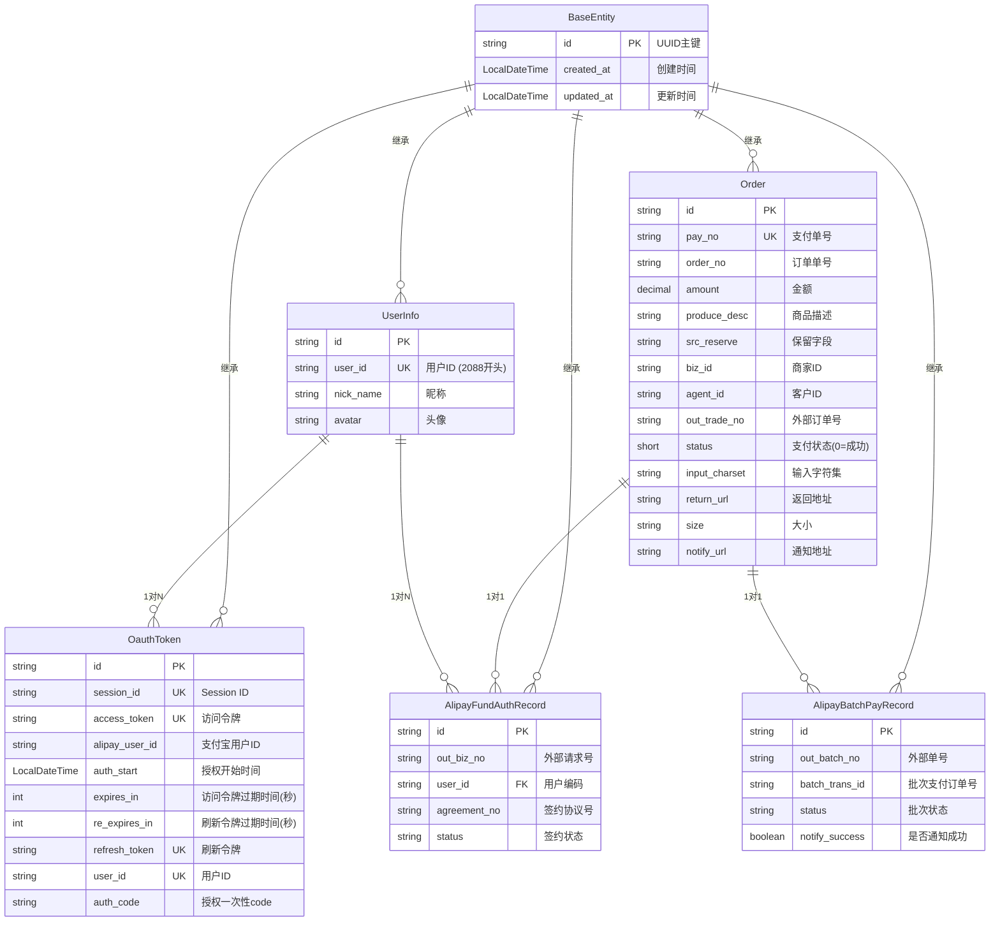
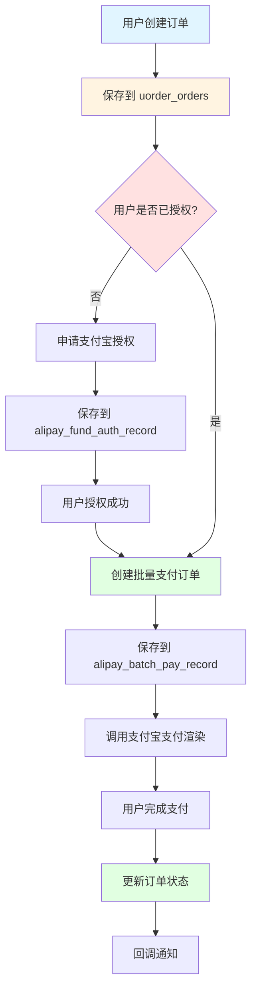

# 实体关系图

## ER 图 (Mermaid)

## 业务流程图

## 数据库表关系详情

### 1. Order (订单表)
- **业务用途**: 存储业务订单信息
- **关联关系**:
  - 与 `AlipayBatchPayRecord` 通过 `out_batch_no` (pay_no) 关联
  - 与 `AlipayFundAuthRecord` 通过 `user_id` 间接关联

### 2. AlipayFundAuthRecord (支付宝资金授权记录)
- **业务用途**: 记录用户资金授权状态
- **关联关系**:
  - 通过 `user_id` 关联到用户
  - 通过 `agreement_no` 维护授权协议

### 3. AlipayBatchPayRecord (支付宝批量支付记录)
- **业务用途**: 记录支付宝批量支付订单
- **关联关系**:
  - `out_batch_no` 对应订单的 `pay_no`
  - `batch_trans_id` 是支付宝返回的订单号

### 4. OauthToken (OAuth令牌)
- **业务用途**: 存储OAuth授权令牌
- **关联关系**:
  - 通过 `user_id` 关联到 `UserInfo`
  - 通过 `session_id` 管理会话

### 5. UserInfo (用户信息)
- **业务用途**: 存储支付宝用户基本信息
- **关联关系**:
  - 与 `OauthToken` 是1对N关系（一个用户可以有多个token）
  - 与 `AlipayFundAuthRecord` 是1对N关系（一个用户可以有多条授权记录）

---

## 字段映射关系

### Order → AlipayBatchPayRecord
| Order 字段 | AlipayBatchPayRecord 字段 |
|------------|---------------------------|
| pay_no | out_batch_no |

### AlipayFundAuthRecord → Order
| 字段 | 说明 |
|------|------|
| user_id | 通过用户关联到订单 |

### UserInfo → OauthToken
| UserInfo 字段 | OauthToken 字段 |
|---------------|-----------------|
| user_id | user_id |
| user_id | alipay_user_id |

---

## 注意事项

1. ⚠️ **外键关系**: 当前设计未使用数据库外键，依赖应用层维护数据一致性
2. ⚠️ **级联操作**: 需要在应用层处理级联删除和更新
3. ⚠️ **事务管理**: 跨表操作需要使用 `@Transactional` 保证数据一致性
4. ⚠️ **数据完整性**: 订单支付流程需要确保订单状态与支付记录同步
