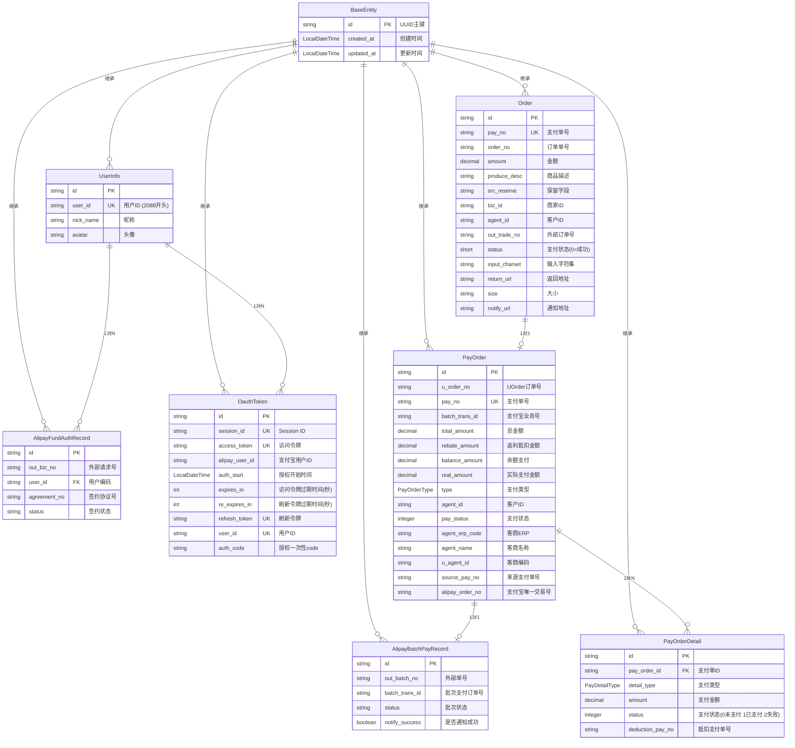
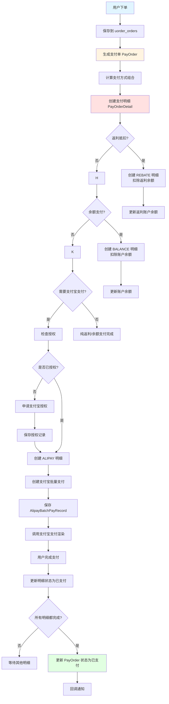
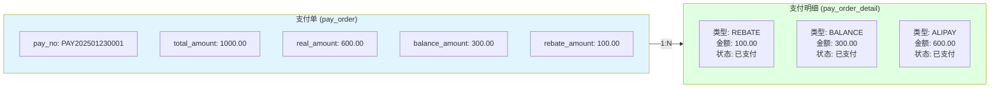
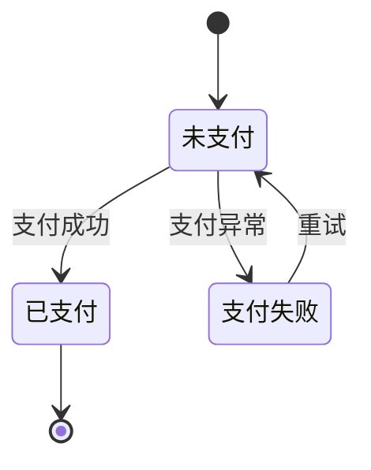

# 实体关系图

## ER 图 (Mermaid)

## 组合支付业务流程图

## 支付单与明细关系图

## 数据库表关系详情

### 1. PayOrder (支付单表) - 核心表
- **业务用途**: 组合支付主单，支持多种支付方式组合
- **关联关系**:
  - 与 `PayOrderDetail` 是1对N关系（一个支付单包含多个支付明细）
  - 与 `AlipayBatchPayRecord` 是1对1关系（支付宝批量支付记录）
  - 与 `Order` 是1对1关系（原始订单）

### 2. PayOrderDetail (支付单明细表)
- **业务用途**: 记录每种支付方式的详细信息和状态
- **关联关系**:
  - 属于 `PayOrder`，通过 `pay_order_id` 关联
  - 支持 REBATE、BALANCE、ALIPAY 三种支付类型

### 3. Order (UOrder订单表)
- **业务用途**: 存储UOrder系统的原始订单数据
- **关联关系**:
  - 通过 `order_no` 与 `PayOrder.u_order_no` 关联

### 4. AlipayFundAuthRecord (支付宝资金授权记录)
- **业务用途**: 记录用户资金授权状态
- **关联关系**:
  - 通过 `user_id` 关联到用户
  - 通过 `agreement_no` 维护授权协议

### 5. AlipayBatchPayRecord (支付宝批量支付记录)
- **业务用途**: 记录支付宝批量支付订单
- **关联关系**:
  - `batch_trans_id` 对应 `PayOrder.batch_trans_id`
  - `out_batch_no` 对应 `PayOrder.pay_no`

### 6. OauthToken (OAuth令牌)
- **业务用途**: 存储OAuth授权令牌
- **关联关系**:
  - 通过 `user_id` 关联到 `UserInfo`
  - 通过 `session_id` 管理会话

### 7. UserInfo (用户信息)
- **业务用途**: 存储支付宝用户基本信息
- **关联关系**:
  - 与 `OauthToken` 是1对N关系（一个用户可以有多个token）
  - 与 `AlipayFundAuthRecord` 是1对N关系（一个用户可以有多条授权记录）

---

## 字段映射关系

### Order → PayOrder
| Order 字段 | PayOrder 字段 |
|------------|---------------|
| order_no | u_order_no |
| pay_no | pay_no (UNIQUE) |

### PayOrder → AlipayBatchPayRecord
| PayOrder 字段 | AlipayBatchPayRecord 字段 |
|--------------|---------------------------|
| pay_no | out_batch_no |
| batch_trans_id | batch_trans_id |
| alipay_order_no | batch_trans_id |

### PayOrder → PayOrderDetail
| PayOrder 字段 | PayOrderDetail 字段 |
|--------------|---------------------|
| id | pay_order_id |

### UserInfo → OauthToken
| UserInfo 字段 | OauthToken 字段 |
|---------------|-----------------|
| user_id | user_id |
| user_id | alipay_user_id |

---

## 支付明细状态流转

**状态说明**:
- `0` - 未支付(锁定状态)：金额已扣除，等待实际支付
- `1` - 已支付：支付完成
- `2` - 支付失败：支付异常，需要处理

---

## 注意事项

1. ⚠️ **外键关系**: PayOrder 和 PayOrderDetail 使用了 `@ForeignKey(ConstraintMode.NO_CONSTRAINT)`，外键约束由应用层维护
2. ⚠️ **级联操作**: 需要在应用层处理级联删除和更新，特别是支付明细状态的同步
3. ⚠️ **事务管理**: 组合支付涉及多个账户操作，必须使用 `@Transactional` 保证数据一致性
4. ⚠️ **金额精度**: 所有金额字段使用 `BigDecimal`，避免浮点数精度问题
5. ⚠️ **支付状态同步**: 多个支付明细需要保证最终状态一致，全部成功或全部失败
6. ⚠️ **幂等性**: 支付回调需要保证幂等性，避免重复处理
