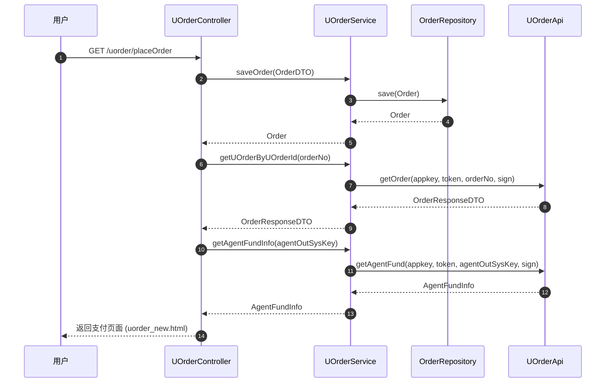
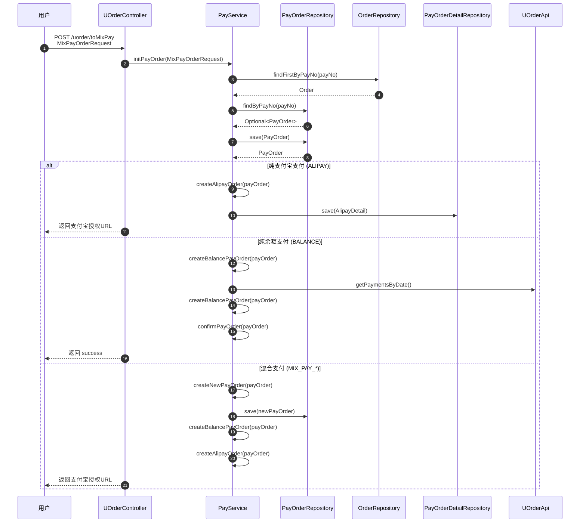
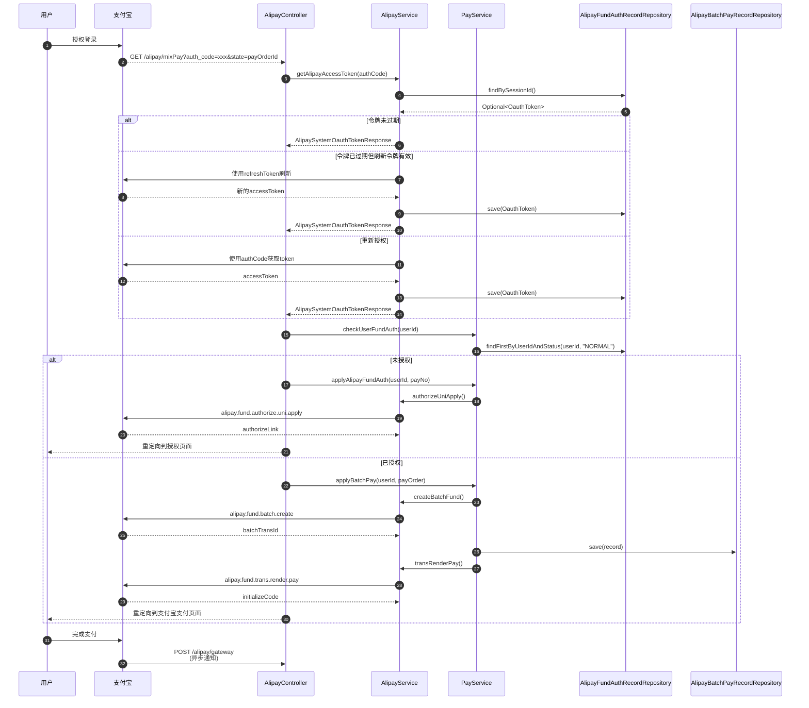
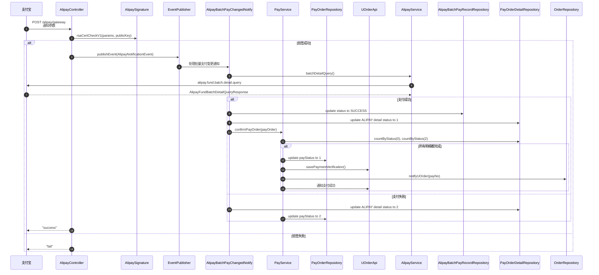
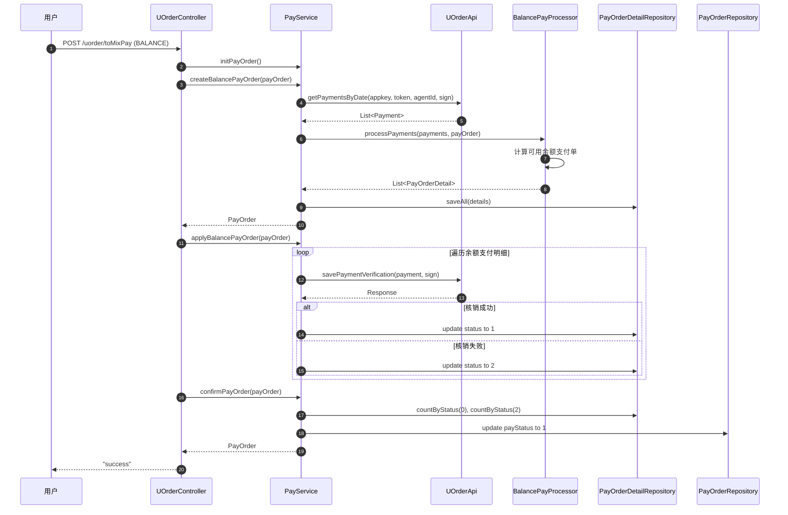
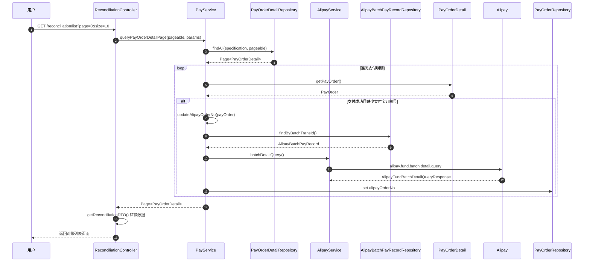
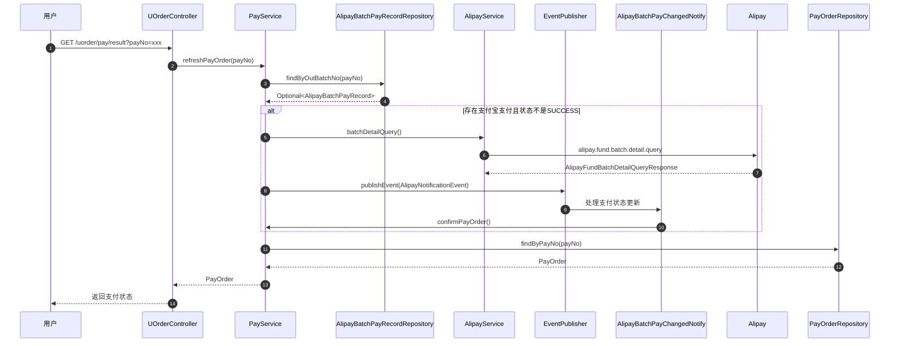

# 系统调用流程与时序图

## 主要业务流程概述

系统包含以下几个核心业务流程：

1. **用户下单流程** - 用户从UOrder系统下单
2. **组合支付流程** - 混合支付（返利+余额+支付宝）
3. **支付宝支付流程** - 支付宝授权和支付
4. **支付宝通知回调** - 支付结果异步通知
5. **余额支付流程** - 余额支付和核销
6. **对账查询流程** - 支付记录查询和导出

---

## 1. 用户下单流程时序图



**说明**：
- 用户从UOrder系统跳转到支付系统
- 系统保存订单信息到本地数据库
- 查询UOrder系统获取订单和余额信息
- 返回支付页面展示给用户

---

## 2. 组合支付流程时序图



**说明**：
- 用户选择支付方式并提交
- 系统根据金额分配创建支付单和支付明细
- 根据支付类型选择不同的支付路径

---

## 3. 支付宝支付完整流程时序图



**说明**：
- 用户先进行支付宝授权获取accessToken
- 检查用户是否已开通资金授权
- 未授权则引导用户授权，已授权则直接创建批量支付订单
- 调用支付宝支付渲染接口，用户完成支付
- 支付完成后支付宝异步通知结果

---

## 4. 支付宝通知回调处理时序图



**说明**：
- 支付宝异步通知支付结果
- 验签确保通知来自支付宝
- 通过事件机制解耦，异步处理通知
- 更新支付明细和支付单状态
- 通知UOrder系统支付结果

---

## 5. 余额支付流程时序图



**说明**：
- 系统查询UOrder获取可用的余额支付单
- 根据支付金额匹配可用余额
- 调用UOrder接口进行余额核销
- 更新支付明细状态
- 确认支付单完成

---

## 6. 对账查询流程时序图



**说明**：
- 用户查询支付明细对账
- 根据时间、订单号、支付状态等条件查询
- 自动补充缺失的支付宝订单号
- 数据转换后返回给前端展示

---

## 7. 支付结果刷新流程时序图



**说明**：
- 前端轮询获取支付结果
- 主动查询支付宝支付状态
- 通过事件机制统一处理状态更新
- 返回最新的支付状态给前端

---

## 核心组件说明

### Controller 层

| Controller | 职责 |
|------------|------|
| `UOrderController` | 处理UOrder订单相关请求 |
| `AlipayController` | 处理支付宝授权和支付回调 |
| `ReconciliationController` | 处理对账查询和导出 |
| `LoginController` | 处理登录和登出 |

### Service 层

| Service | 职责 |
|---------|------|
| `PayService` | 支付单创建、支付处理、状态管理 |
| `AlipayService` | 支付宝API调用、OAuth管理 |
| `UOrderService` | UOrder订单查询 |
| `UOrderApi` | UOrder接口调用（Feign Client） |

### Event Listener

| Listener | 职责 |
|----------|------|
| `AlipayBatchPayChangedNotify` | 处理批量支付变更通知 |
| `AlipayFundAuthStatusNotify` | 处理资金授权状态通知 |

### Processor

| Processor | 职责 |
|-----------|------|
| `BalancePayProcessor` | 处理余额支付逻辑 |

---

## 数据流转关键节点

### PayOrder 状态流转

```
创建 (payStatus=0) → 支付中 → 已支付 (payStatus=1) / 支付失败 (payStatus=2)
```

### PayOrderDetail 状态流转

```
创建 (status=0) → 已支付 (status=1) / 支付失败 (status=2)
```

### 支付类型判断

```
totalAmount = rebateAmount + balanceAmount + realAmount

- rebateAmount > 0 && balanceAmount > 0 && realAmount > 0: MIX_PAY_ALIPAY_BALANCE_REBATE
- balanceAmount > 0 && realAmount > 0: MIX_PAY_ALIPAY_BALANCE
- balanceAmount > 0: BALANCE
- realAmount > 0: ALIPAY
```

---

## 注意事项

1. **并发控制**：余额支付和支付宝支付需要考虑并发问题，避免重复支付
2. **幂等性**：支付宝回调处理需要保证幂等性，避免重复处理
3. **事务管理**：支付流程涉及多个表更新，必须使用 `@Transactional`
4. **超时处理**：支付宝支付链接30分钟后失效，需要处理超时场景
5. **异常处理**：支付失败需要回滚已处理的操作，保证数据一致性
6. **异步通知**：支付宝异步通知可能延迟，前端需要轮询或使用WebSocket
